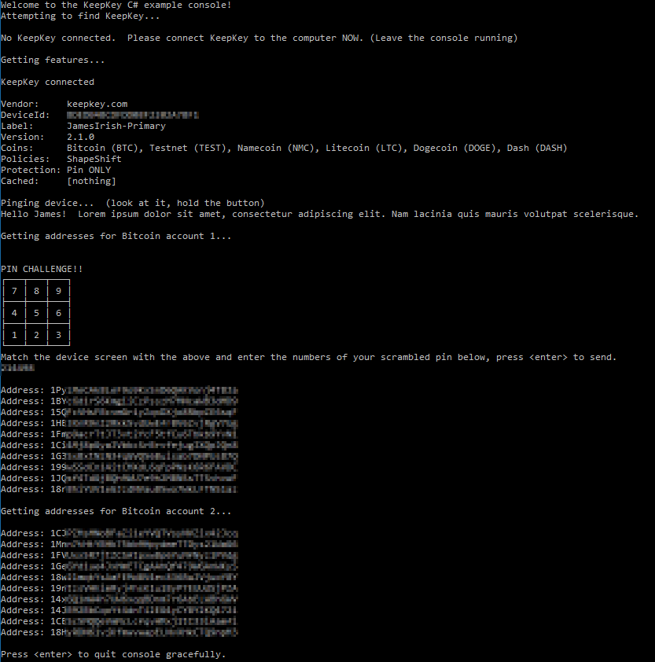

# KeepKeySharp

C# api for the KeepKey hardware wallet.  Uses HID (Human Interface Device) drivers over USB to communicate with the KeepKey device.

[](https://ci.appveyor.com/project/JamesIrish/keepkeysharp)

## Project Status

Only basic 'Initialize', 'Features', 'Ping' & 'GetPublicKey' are currently implemented.   This library is licensed under MIT so you can clone, fork, distribute as you need.

## Dependencies

This library would not be possible without the excellent [HID library](https://github.com/mikeobrien/HidLibrary) and [NBitcoin](https://github.com/MetacoSA/NBitcoin).

## Usage

Install the [KeepKeySharp via NuGet]() or clone this repository.

`Install-Package KeepKeySharp`

Create an instance of `KeepKeyDevice`.  We recommend wrapping this in a `using` statement.

```c#
using (var kk = new KeepKeyDevice())
{
    ...
}
```

Connect to event handlers and attempt to talk to the KeepKey.

```c#
...
kk.Connected += KkOnConnected;
kk.Disconnected += KkOnDisconnected;

kk.TryOpenDevice();
...
```

The call to `TryOpenDevice` asks Windows for details on the attached HID compatible devices on your system and attempts to match the KeepKey.  If it cannot find a KeepKey this method returns `false`.

The KeepKey does **not** have to be connected first.  If `TryOpenDevice` fails you can choose to wait for the KeepKey to be connected by calling `WaitForKeepkeyConnectionAsync` - well named, no?

```c#
if (!kk.TryOpenDevice())
{
    kk.WaitForKeepKeyConnectionAsync();
}
```

This call can be `await`ed or you can rely on the 'Connected' event.

Once connected you can begin to send messages to the KeepKey.

### Initialize

This should be the first call in any interaction with the KeepKey. It allows the features of the device to be returned including the device id, label, language, coins supported and version number.

```c#
var features = kk.Initialize();
```

### Ping

This serves as a good basic test of the API.  It allows you to print a message on your KeepKey screen.   Passing true *(the default)* to the second argument will cause the KeepKey to require you to press & hold the device button to continue.

```c#
var pingReply = kk.Ping("Hello world!", true);
```

`pingReply` should contain the text you specified. _echooooo_

### GetPublicKey

Returns the Extended Public Key for the account specified.  Pass a BIP32 key string to the method to get the public key from which you can extract the public address (and thus derive a balance or transactions etc. etc.)   This method MAY call the callback supplied by the first argument requesting the users pin. This is scrambled version.  See the Console project for specifics.

```c#
var pinChallengeFunction = new Func<PinMatrixRequestType?, string>(t => "12345678");
var publicKey = kk.GetPublicKey(pinChallengeFunction, "44'/0'/0'/0/0");
var extPubKey = ExtPubKey.Parse(publicKey.Xpub, Network.Main);
var pubKey = extPubKey.PubKey;
var address = pubKey.GetAddress(Network.Main);
```

The above requests the first public key of the first account for Bitcoin. Once we have the public key we use `NBitcoin` to extract the public address for the main network.  With this we can query the blockchain for transactions or the account balance.

## Sample

This repository contains a project called [KeepKeySharp.Console](https://github.com/JamesIrish/KeepKeySharp/blob/master/KeepKeySharp.Console/Program.cs) that demonstrates the above in action.  Clone this repository and build the solution (you will need .Net 4.5, Visual Studio and to have restored the NuGet packages).  DISCONNECT your KeepKey, run the console project and follow the output.


[]
